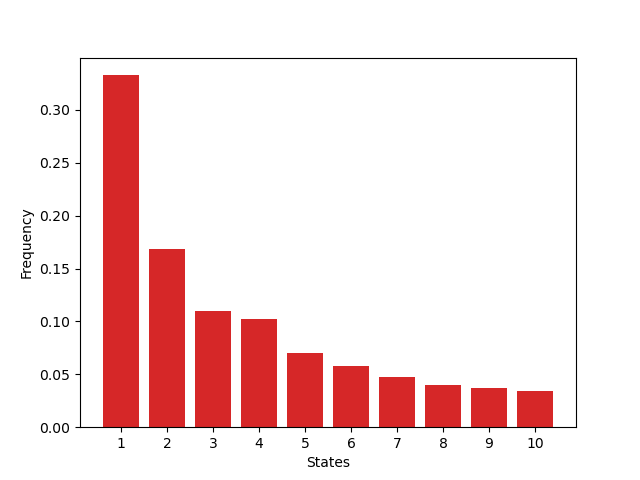

# Sample Space Reducing Processes 

## Project Overview 

This project contains my implementation of The Sample Space Reducing Process variants (i.e., Standard, Noisy, and Cascade). The implementation is based on the description in [Sample space reducing cascading processes produce the full spectrum of scaling exponents](https://arxiv.org/abs/1703.10100). This `README` contain technical information about the implementation, to get some background of the process checkout [theory](./cpp/README.md)


> **Note:** The above animation was made using `SFML` and `Box2d` see  the repo [ssr animation](https://github.com/aredjil/ssr_anim) for the code :smiley:.

## Dependencies

To use this code you will need the following modules installed on your system

- `cmake` 
- `GCC` or another `C++17-compatible` compiler
- `Python` ≥ 3.8 (for visualization)
  - `numpy`
  - `matplotlib`
  - `scipy`
  - `pybind11`
  - `jupyter`
  - `powerlaw`

The main code is written is `C++`, and it only requires a `C++` compiler. Other parts of the code post-process the data and produce some visulziations, that is done using `Python`, for that you will need the rest of the packages listed.    

If you happen to be using `conda` for package mangement you simply create the enviornement and install the requirements using the follwoing command. 

```bash 
bash> conda env create -f env.yaml
```
This will create an `conda` enviornement named `ssr_env`. Activate it to start using it. 

```bash
bash> conda activate ssr_env
```

## Compiling 

1. Clone the repo:

```bash
bash> git clone https://github.com/aredjil/ssr.git
```

2. Navigate to the directory contaning the code: 

```bash 
bash> cd ssr 
```

3. Compile with `cmake`:

```bash
bash> cmake -S . -B cmake-build 
bash> cmake --build cmake-build
```

or alternatively:

```bash
bash> mkdir -p cmake-build 
bash> cd cmake-build 
bash> make 
```

or manually, 

```bash
bash> g++ -O3 -march=native main.cpp -I./include -o ssr_simulator.x 
```

## Usage 


```bash
bash> ./build/ssr_simulator.x [--type TYPE] [--N N] [--m MAX_ITER] [--mu MU] [--lambda LAMBDA] [--help]
```

| Option            | Description                                                  | Default Value |
| ----------------- | ------------------------------------------------------------ | ------------- |
| `--type TYPE`     | Type of SSR simulation (`std`, `noisy`, `cascade`)           | `cascade`     |
| `--N N`           | Number of states in each SSR cascade                         | 10001         |
| `--m MAX_ITER`    | Number of SSR cascades to simulate                           | 3000          |
| `--mu MU`         | Parameter controlling cascade behavior (`cascade` type only) | 1.0           |
| `--lambda LAMBDA` | Noise parameter (`noisy` type only)                          | 1.0           |
| `--help`          | Show usage information and exit                              | -             |

**Example:**

```bash 
bash> ./build/ssr_simulator.x --type cascade --N 10001 --m 1 --mu 1.0
```
Below is a sample output of the code. 

```bash 
7008
236
207
44
14
13
2
1
```

On the other hand if you want to define your own main. First you need to include the header. 

```c++
#include "./include/ssr.hpp"
```

The create an instance of the `SSR` class, by invoking the create method of `SSRCTX` class. within the angel brackets specify the type of simulation (`STDSSR`, `NoisySSR`, or `CascadeSSR`). `create()` method takes the simulation paramters.

```c++
#include "./include/ssr.hpp"
#include<iostream>

int main(int argc, char** argv)
{
    ssr_example = SSRCTX<CascadeSSR>::create(N, mu);
    return 0;
}
```
Then to run the simulation you need to call the `run()` method. The run method takes one argument `verbose` which is set to `false` by default, it specifies whether to print the states visted to the console   or not, this is useful to store the result in external files by redirecting the output of the code to some text files `./excutable.x  > input.txt`. 

```c++
#include "./include/ssr.hpp"
#include<iostream>
#include<vector> // To store the result of the simulation 

int main(int argc, char** argv)
{
    
    ssr_example = SSRCTX<CascadeSSR>::create(N, mu);
    std::vector<int> states; // Vector to store the result of one run. 
    states = ssr_example->run(verbose=false);
    return 0;
}
```
`states` vector has the labels of states visited for one run of the process. To get statistical results run the simulation several times.  

```c++
#include "./include/ssr.hpp"
#include<iostream>
#include<vector> // To store the result of the simulation 

int main(int argc, char** argv)
{
    
    ssr_example = SSRCTX<CascadeSSR>::create(N, mu);
    std::vector<int> states; // Vector to store the result of one run. 
    for (int i = 0; i < max_iter; ++i)
    {
    states = simulator->run(); // I print the results to the screen and redirect the results to an external file by setting verbose to true. 
    }
    // Some post processing ... 
    return 0;
}
```

## Python Bindings
This project includes `Python` bindings. To build the corresponding module run the following command.  
```bash 
bash> python setup.py build_ext --inplace
```
This command compiles the `C++` extension and places the resulting `.so` file directly in the source directory (e.g., `pyssr.cpython-<version>-x86_64-linux-gnu.so`). This allows you to immediately import and use the module from within a `Python` script of jupyter Notebook. 
The module works similarly to the `C++` code. 

```python
#! /usr/bin/env python3 
import pyssr 

N = 1001
mu = 1.0 

ssr_example = pyssr.CascadeSSR(N, mu)
states = ssr_example.run()
```
`states` is `numpy.ndarray`. 

Or in jupyter-notebook

```python
parent_dir = os.path.abspath('..') 
if parent_dir not in sys.path:
    sys.path.insert(0, parent_dir) # To add the path of the module 

import pyssr  

N = 1001
mu = 1.0 

ssr = pyssr.CascadeSSR(N, mu)
for _ in range(1000):
    states = ssr.run()  
```
**Example:**

A complete example of using the `Python` module would be 

```python 
#! /usr/bin/env python3 
import pyssr
from collections import Counter
import matplotlib.pyplot as plt 
import numpy as np 

def main():
    N = 11
    mu = 1.0 
    max_iter = 1000
    ssr = pyssr.CascadeSSR(N, mu)
    all_states = []  
    for i in range(max_iter):
        states = ssr.run()    
        all_states.extend(states) 

    all_states = np.array(all_states)
    states_count = Counter(all_states)
    ordered_count = states_count.most_common()

    values = np.array([item[0] for item in ordered_count])
    counts = np.array([item[1] for item in ordered_count])
    counts = counts / np.sum(counts)

    plt.bar(values, counts, color='tab:red')
    plt.xticks(range(1, 11,1), [f"{i}" for i in range(1, 11, 1)])
    plt.xlabel("States")
    plt.ylabel("Frequency")
    plt.show()
    
if __name__ == "__main__":
    main()

```

Which will visulzie the distrubution of state visits.



## Future Extensions 
- Implementing different priors of states (e.g., exponential, polynomial, )


> **Note:** For large simulations (high number of states/multiplicative factor) it is better to use the `C++` code. Since most likely the `Pyhton` code will break because of high memory usage. It is here only for demo purposes. 
> **Note:** The seeding is done in `Random.hpp` header.
