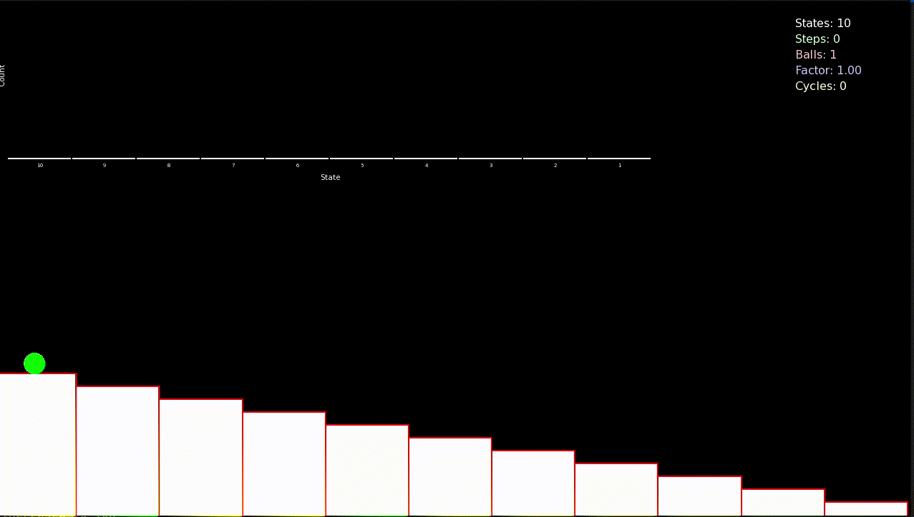

# Sample Space Reducing Process
## Introduction 

## Zipfs Law in Natural Langauges

Many phenomen follow a power law, where the probability distrubution of an event is inversly proptional to its rank $P(r=i) \propto i^{-\alpha}$, for some exponent $\alpha \in (0, +\infty]$. One example of such phenomena of word distrubution in natural langauges which follows Zipf's law, a power law with a unit exponent $\alpha \approx 1.0$. The figure below shows the frequency distrubution of words in two books, namely: Oliver Twist and Moby Dick. The two books have different total word count `[n]`.

## Distrubution of State Visits

<div align="center">
  
  <p><em>Figure 1: Word distribution in Oliver Twist and Moby Dick. Using Gutenberg project data.</em></p>
</div>


Fitting the ranks of occurance words using [`plfit`](https://github.com/ntamas/plfit), based on the method proposed by *A.Clause et al* in [[1](https://arxiv.org/abs/0706.1062)] 
<!-- Cite the paper at the end of the README.md -->
resulted in 

```bash 
data/raw/rank_counts/Oliver-Twist.dat:
	Discrete MLE
	alpha =      1.45174
	xmin  =     51.00000
	L     = -657063.98867
	D     =      0.11169

```

for Oliver Twist, and 
```bash 
data/raw/rank_counts/Moby-Dick.dat:
	Discrete MLE
	alpha =      1.35965
	xmin  =     31.00000
	L     = -1087942.06924
	D     =      0.11236

```
for Moby Dick, suggesting that the count distrubution of words follow a power law starting from the estimated $x_{min}$ with exponents  $\hat{\alpha}_{OT} \approx 1.5$, and $\hat{\alpha}_{MD} \approx 1.4$. Sample space reducing process attempts to explain Zipf's law in word counts [[2](https://royalsocietypublishing.org/doi/10.1098/rsif.2015.0330)]. 

## Standard Sample Space Reducing Process

Sample space reducing process (SSR) $\phi$ is a stochastic process defined by a shrinking sample space, this processes models ageing, in a sense that with each iteration of the process the space of possible states available to the process is reduced. More concretly, let there be in total $N$ possible states available to the SSR element, it starts at the highest state $i=N$, then with uniform probability $Pr(i \rightarrow j)=\frac{1}{i-1}$ it jumps to any of the lower states $j \in \{1, \dots, i-1\}$. The only rule is that the object is allowed to jump solely downwards to lower states, once the element reaches the lowest state $1$ the process either terminates or restarts [[2](https://www.nature.com/articles/s41598-017-09836-4#auth-Stefan-Thurner-Aff1-Aff2-Aff3-Aff4)].


<div align="center">
  
  <p><em>Figure 2: Standard sample space reducing process.</em></p>
</div>

<div align="center">
  
  <p><em>Figure 3: Standard sample space reducing process state visits distrubution.</em></p>
</div>

### Distrubution of State Visits

<div align="center">
  
  <p><em>Figure 2: Standard sample space reducing process state visits distrubution using 10,000 states and 1000,000 restarts.</em></p>
</div>

It has been showen that the number of visits per state $Pr(s=i)$ follows Zipf's law $Pr(s=i) \propto i^{-1}$ [[3](https://www.pnas.org/doi/10.1073/pnas.1420946112)]. 

## Noisy Sample Space Reducing Process

A varient of the SSR process is the so-called noisy SSR $\Phi$, where the SSR process $\phi$ is mixed with a completely random $\phi_R$ using a mixing ratio $\lambda \in [0, 1]$, such that  $\Phi^{(\lambda)} = \lambda\phi + (1- \lambda)\phi_R$. $\phi_R$ correspond to the completly random process where the element is allowed to jump to any state without restrictions. In this setting, the rule is, with probability $\lambda$ jump downward following the standard SSR process, and with probability $1-\lambda$ jump to any of the $N$ states. 


### Distrubution of State Visits

<div align="center">
  
  <p><em>Figure 4: Noisy sample space reducing process state visits distrubution using 10,000 states and 1000,000 restarts, for different values of mixing ratio.</em></p>
</div>

it has been showen that the number of state visits follows a power law where the exponent is the mixing ratio $\lambda$. [[3](https://www.pnas.org/doi/10.1073/pnas.1420946112)]

## Cascade Sample Space Reducing Process 
 
Anotehr varient of the SSR process is defined through a multiplicative factor $\mu$. At each jumping step the SSR element divides into $\mu$ element that in turn follow the SSR rules. it has been showen that the frequncy of visits per state follows a power law with an exponent equal to the value of the multiplicative factor $\mu$. $Pr(s=i) \propto i^{-\mu}$. when $\mu$ is a fractional number such that $\mu = \left\lfloor \mu \right\rfloor + \delta$ then with probability $\delta$, $\left\lfloor \mu \right\rfloor + 1$ elements are created, and with probability $1-\delta$, $\left\lfloor \mu \right\rfloor$ elements are created. 

<div align="center">
  
  <p><em>Figure 5: Sample space reducing process with cascades</em></p>
</div>


<!--  -->


It has been showen that the distrubution of visits follows a power law with an exponent $\mu$, $Pr(s=i) \propto i^{-\mu}$ [[1](https://www.nature.com/articles/s41598-017-09836-4#auth-Stefan-Thurner-Aff1-Aff2-Aff3-Aff4)].  

### Distrubution of State Visits


<div align="center">
  
  <p><em>Figure 6: Sample space reducing process with cascades state visits distrubution, using 10,000 states, for different values of multiplicative factor.</em></p>
</div>


### Avalanche Size Distrubution


<div align="center">
  
  <p><em>Figure 7:Avalanche Size Distrubution.</em></p>
</div>


<div align="center">
  
  <p><em>Figure 8:Average avalache size for different values of the multiplicative factor.</em></p>
</div>
