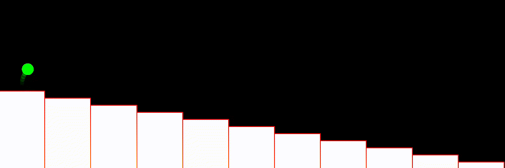

# Sample Space Reducing Process 
## Standard Sample Space Reducing Process

Sample space reducing process (SSR) is a stochastic process defined by a shrinking sample space. An object of the SSR starts at the highest state $i=N$, then with probability $Pr(i \rightarrow j)$ it jumps to any of the lower states $j \in \{1, \dots, N-1\}$. The only rule is that at any state the object is only allowed to jump to lower states, backward jumps are forbiden. Once the element reaches the lowest state $1$ the process either stops or restarts [[1](https://www.nature.com/articles/s41598-017-09836-4#auth-Stefan-Thurner-Aff1-Aff2-Aff3-Aff4)].

It has been showen that the number of visits per state $Pr(s=i)$ follows Zipf's law $Pr(s=i) \propto i^{-1}$, how often a state is visted is inversly proptional to it's order [[1](https://www.nature.com/articles/s41598-017-09836-4#auth-Stefan-Thurner-Aff1-Aff2-Aff3-Aff4), [2](https://www.pnas.org/doi/10.1073/pnas.1420946112)]

To verify that numerically, I genrated $3000$ realizations of a full standard SSR process with $N=10000$ states (see: [`./data/zipf/ssr_1.0.txt`](./data/zipf/ssr_1.0.txt)), and used [`PowerLaw` package](https://github.com/schae234/powerlaw) written in `Python` to estimate the exponent of the power law, and found that the estimated exponent was $\hat{\alpha}=1.0$. with power law behavior starting from $x_{min}=27$. Similar were found results using [plfit](https://github.com/ntamas/plfit) commandline in `C`, where the estimated exponent was $\hat{\alpha}=1.3$ and $x_{min}=27$.

> Both codes are based on the paper [Power-law distributions in empirical data](https://arxiv.org/abs/0706.1062), several more packages in other langauges could be found at the [powerlaw](https://aaronclauset.github.io/powerlaws/) provided by the authors. 
## Stochastic Sample Space Reducing Process

## Cascade Sample Space Reducing Process 
 

This read me will contain instructions on: 
- [ ] Code description :) 
- [ ] How to run the code 
- [ ] How to regenerate the observations 
- [ ] How to visulize the results 
- [ ] Possible code optimizations ? 

