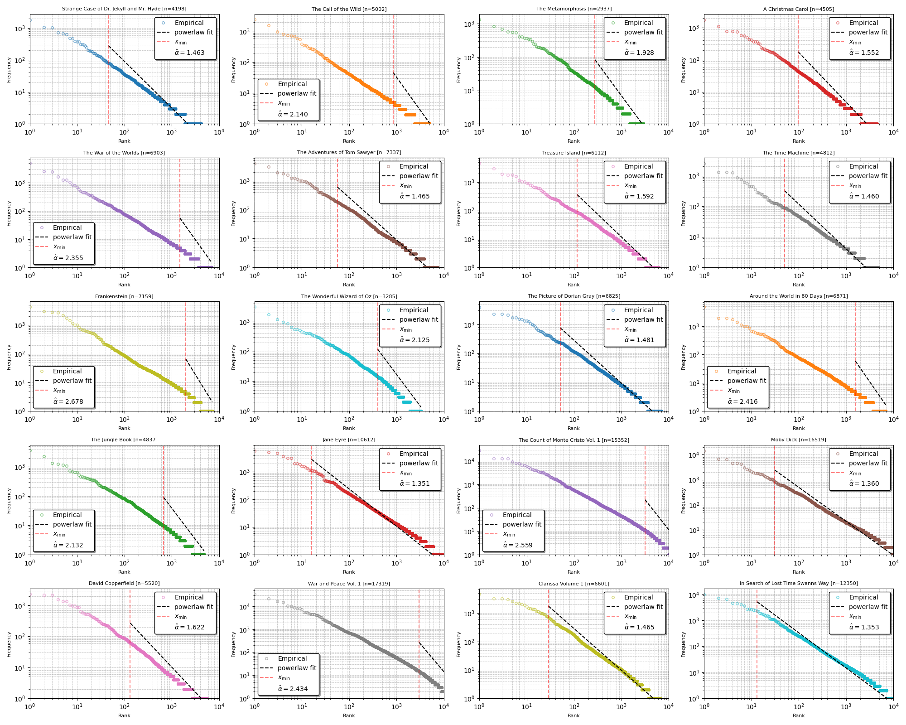

# Sample Space Reducing Process 

## Table of Contents
- [Introduction](#introduction)
- [Sample Space Reducing Processes](#sample-space-reducing-processes)
  - [Standard SSR](#standard-ssr)
  - [Noisy SSR](#noisy-ssr)
  - [SSR Cascades](#ssr-cascades)
- [Conclusion](#conclusion)
- [References](#references)
- [Appendix](#appendix)

## Introduction 

Many complex systems follow a ubiquitous pattern, namely power law,

$$
P(R=r) \propto \frac{1}{r^{\alpha}}
$$

In language, this appears as **Zipf's law**: the frequency of occurrence of a word in a corpus decreases as a power of its rank ($\alpha \approx 1$). A small set of words accounts for most of language usage, while higher-rank words are rarer — but not as rare as exponential decay would suggest, making the distribution heavy-tailed.  

Power laws are not unique to language: they are observed in many other phenomena, such as city sizes, earthquake magnitudes, wealth distribution, and severity of terrorist attacks.

    
    
<em>Zipf's law observed in word counts across 20 books. Books taken from <a href="https://www.gutenberg.org/">Project Gutenberg</a>. Fit done using the <code>powerlaw</code> package [5].</em>

The origin of power laws is still debated. Many attempts have been made to explain their emergence, including preferential attachment, Mandelbrot's model, and **sample space reducing processes**.

---

## Sample Space Reducing Processes

SSR processes come in several flavors, all producing a range of power laws. They are characterized by a shrinking sample space $\Omega$. Below I present three versions: standard SSR, noisy SSR, and SSR cascades, with numerical simulations.

### Standard SSR

The standard SSR $\phi$ is defined on a sample space with $N$ states $\Omega = \{N, \dots, 1\}$, each with prior probability $\pi_i$. The process starts at $X_0 = N$. At each step $t>0$, it jumps randomly to a lower state $i < j$ according to transition probability $P(X_{t+1}=i \mid X_t=j) = p(i\mid j)$. Upward jumps are forbidden.  

When the process reaches $X_t = 1$, it either stops or restarts.  

The sample space shrinks:

$$
|\Omega_1| < |\Omega_2| < \dots < |\Omega|
$$

and is nested:

$$
\Omega_1 \subset \dots \subset \Omega_i \subset \Omega.
$$

Conceptually: imagine a staircase with $N$ steps. A ball starts at the top and can only move downward until reaching the last step.

    
    
<em>SSR animation: the staircase formulation with a uniform one-jump kernel and prior.</em>

It has been shown that the probability of visiting state $i$ is exactly Zipf's law [[1](https://arxiv.org/pdf/1407.2775)]:

$$
p(i) = i^{-1}.
$$

    
    
<em>SSR for 3 states showing the different paths of the process.</em>

In language, sentence formation is constrained by grammar: the first word comes from the full space, but each subsequent word reduces the possible choices. This nested structure suggests Zipf’s law emerges naturally.

**Results**

Running the standard SSR with $N=10^4$ states and $M=10^6$ restarts produces a histogram that fits Zipf's law. Fitting with MLE [[2](https://arxiv.org/abs/0706.1062)] confirms the power-law fit, consistent with word counts in *Moby-Dick*.

  

    
    
<em>Zipf's law observed in SSR state visit frequencies.</em>

  

  

    
    
<em>Word counts in <em>Moby-Dick</em> vs SSR state counts.</em>

  

I also found that the state visit distribution is sensitive to the transition probability $p(i\mid j)$.  

- With a gap-based transition $p(i \mid j) \propto (j-i)^\alpha$:  
  - $\alpha = 0$: standard SSR, exact Zipf’s law.  
  - $\alpha > 0$: higher states preferred.  
  - $\alpha < 0$: lower states preferred.  

Fitting shows truncated power-law behavior.

    
    
<em>SSR state counts vs rank with gap-based non-uniform transition.</em>

With softmax transitions $p(i \mid j) \propto e^{-\beta i}$:

- $\beta = 0$: uniform transitions, $p(i)=i^{-1}$  
- $\beta > 0$: higher states favored  

    
    
<em>SSR state counts vs rank with exponential transition probabilities.</em>

**Summary:** Uniform prior + uniform transitions → perfect Zipf’s law. Non-uniform transitions → deviations (truncated power laws).

---

### Noisy SSR 

A noisy SSR $\mathbf{\Phi}^{(\lambda)}$ mixes standard SSR $\phi$ with an unconstrained random walk $\phi_R$, via $\lambda \in [0,1]$:

$$
\mathbf{\Phi}^{(\lambda)} = \lambda \phi + (1-\lambda) \phi_R.
$$

- $\lambda = 1$: pure SSR  
- $\lambda = 0$: pure random walk  

To study stationary statistics, define $\phi_\infty$: the SSR that restarts at a random state after reaching 1. Then:

$$
\mathbf{\Phi}^{(\lambda)}_\infty = \lambda \phi_\infty + (1-\lambda)\phi_R.
$$

We are interested in $p^{(\lambda)}(i)$:

$$
p^{(\lambda)}(i) = \sum_{j=1}^N p(i \mid j) p^{(\lambda)}(j).
$$

After simplification, one obtains the recursion:

$$
p^{(\lambda)}(i+1) = \left(1+\frac{\lambda}{i}\right)^{-1} p^{(\lambda)}(i).
$$

Thus,

$$
\frac{p^{(\lambda)}(i)}{p^{(\lambda)}(1)} = \prod_{j=1}^{i-1}\left(1+\frac{\lambda}{j}\right)^{-1}.
$$

For large $i$, using $\log(1+\lambda/j) \approx \lambda/j$:

$$
p^{(\lambda)}(i) \propto i^{-\lambda}.
$$

**Results**

Simulating the noisy SSR with $10^4$ states and $10^6$ runs confirms the analytical result.

    
    
<em>Noisy SSR numerical fit.</em>

---

### SSR Cascades

SSR cascades start with $\mu$ balls at the top state $N$. Each ball jumps to a lower state, then splits into $\mu$ new balls, repeating until all reach state 1.  

The visit frequencies follow a power law with exponent $\mu$ [[3](https://arxiv.org/pdf/1703.10100)]:

$$
p(i) \propto i^{-\mu}.
$$

    
    
<em>SSR cascades with multiplicative factor 2.</em>

**Results**

Simulation matches theory. For real-valued $\mu$, decompose $\mu = \lfloor \mu \rfloor + \delta$ and randomize splitting accordingly.

    
    
<em>Cascade SSR using different multiplicative factors.</em>

Defining avalanche size $s$ as the number of balls reaching state 1, the distribution $f(s)$ follows a Gamma distribution [[paper](https://www.nature.com/articles/s41598-017-09836-4)]:

$$
f(s) \propto s^{\alpha-1} e^{-\lambda s}, \quad \langle s \rangle \propto \frac{N^\mu}{e^{a\mu}}.
$$

    
    
<em>Avalanche size distribution for $\mu=2$, with Gamma fit.</em>

    
    
<em>Average avalanche size vs multiplicative factor $\mu$ for different $N$.</em>

---

## Conclusion

Sample space reducing processes offer a simple mechanism for the emergence of power laws.  

- **Standard SSR** produces exact Zipf’s law.  
- **Noisy SSR** yields tunable exponents $p(i)\propto i^{-\lambda}$.  
- **SSR cascades** generalize further, giving $p(i)\propto i^{-\mu}$ with avalanche size statistics following Gamma distributions.  

These processes provide an elegant, general explanation for power-law patterns.

---

## References

[1] [Sample space reducing cascading processes produce the full spectrum of scaling exponents](https://arxiv.org/abs/1602.05530)  
Bernat Corominas-Murtra, Rudolf Hanel, Stefan Thurner  

[2] [Understanding scaling through history-dependent processes with collapsing sample space](https://arxiv.org/abs/1407.2775)  
Bernat Corominas-Murtra, Rudolf Hanel, Stefan Thurner  

[3] [Sample space reducing processes produce the full spectrum of scaling exponents](https://arxiv.org/abs/1703.10100)  
Bernat Corominas-Murtra, Rudolf Hanel, Stefan Thurner  

[4] [Power-law distributions in empirical data](https://arxiv.org/abs/0706.1062)  
Aaron Clauset, Cosma Rohilla Shalizi, M. E. J. Newman  

[5] [Powerlaw: a Python package for analysis of heavy-tailed distributions](https://arxiv.org/abs/1305.0215)  
Jeff Alstott, Ed Bullmore, Dietmar Plenz  

---

## Appendix 

Alternative derivation of the state visit distribution for random initial state $X_0 \in \Omega$.  

- One-step transition probability:
  $$
  p(i\mid j) =
  \begin{cases}
  0, & j < i, \\
  \tfrac{1}{j-1}, & j > i.
  \end{cases}
  $$
- Prior: $P(X_0=j)=\pi_j$  
- Visiting probability:
  $$
  T(i\mid j) =
  \begin{cases}
  1, & j=i, \\
  0, & j<i, \\
  \sum_{k=1}^{j-1} p(k\mid j)T(i\mid k), & j>i.
  \end{cases}
  $$

Base case: $T(i\mid i)=1$. For $j=i+1$:
$$
T(i\mid i+1)=\frac{1}{i}.
$$

By induction, same formula holds for $j>i$.  

Thus the general visiting probability is

$$
\boxed{p(i) = \pi_i + \sum_{j=i+1}^N \pi_j T(i\mid j)}
$$

For uniform jumps $p(i\mid j)=1/(j-1)$:

$$
\boxed{p(i) = \pi_i + \frac{1}{i}\sum_{j=i+1}^N \pi_j}
$$

- If $\pi$ vanishes faster than $1/i$, then $p(i)\propto \pi_i$.  
- If slower, $p(i)\propto 1/i$.  

For uniform prior $\pi_i=1/N$:

$$
p(i) = \frac{1}{N}\Big(1 + \frac{N-i}{i}\Big) = \frac{1}{i}.
$$

Thus standard SSR with uniform prior yields exact Zipf’s law.
