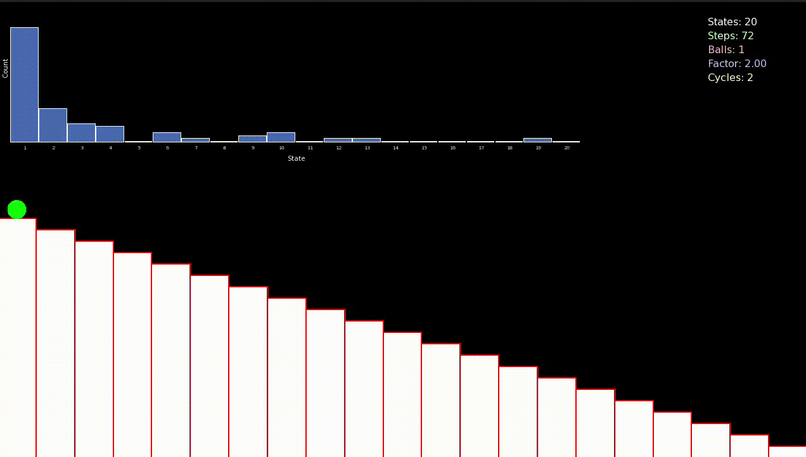

# Sample Space Reducing Process 
## Standard Sample Space Reducing Process

Sample space reducing process (SSR) is a stochastic process defined by a shrinking sample space, this processes models ageing, in a sense that with each iteration of the process the space of possible states available to the process is reduced. More concretly, let there be in total $N$ possible states available to the SSR element, it starts at the highest state $i=N$, then with uniform probability $Pr(i \rightarrow j)=\frac{1}{N}$ it jumps to any of the lower states $j \in \{1, \dots, N-1\}$. The only rule is that the object is only allowed to jump to lower states, backward jumps are forbiden in this case. Once the element reaches the lowest state $1$ the process either stops or restarts [[1](https://www.nature.com/articles/s41598-017-09836-4#auth-Stefan-Thurner-Aff1-Aff2-Aff3-Aff4)].

It has been showen that the number of visits per state $Pr(s=i)$ follows Zipf's law $Pr(s=i) \propto i^{-1}$ [[2](https://www.pnas.org/doi/10.1073/pnas.1420946112)]

 
<!-- *Figure 1: This is the caption of the image.* -->

## Noisy Sample Space Reducing Process

A varient of the SSR process is the so-called noisy SSR $\Phi$, where the SSR process $\phi$ is mixed with a completely random $\phi_R$ using a mixing ratio $\lambda \in [0, 1]$, such that  $\Phi^{(\lambda)} = \lambda\phi + (1- \lambda)\phi_R$. $\phi_R$ correspond to the completly random process where the element is allowed to jump to any state without restrictions. In this setting, the rule is, with probability $\lambda$ jump downward following the standard SSR process, and with probability $1-\lambda$ jump to any of the $N$ states. it has been showen that the number of state visits follows a power law where the exponent is the mixing ratio $\lambda$. [[2](https://www.pnas.org/doi/10.1073/pnas.1420946112)]

$\lambda = 0 $ corresponds to the unconstrained random walk, and $\lambda =1$ to the standard SSR. 
<!-- *Figure 1: This is the caption of the image.* -->

## Cascade Sample Space Reducing Process 
 
Anotehr varient of the SSR process is defined through a multiplicative factor $\mu$. At each jumping step the SSR element divides into $\mu$ element that in turn follow the SSR rules. it has been showen that the frequncy of visits per state follows a power law with an exponent equal to the value of the multiplicative factor $\mu$. $Pr(s=i) \propto i^{-\mu}$. when $\mu$ is a fractional number such that $\mu = \left\lfloor \mu \right\rfloor + \delta$ then with probability $\delta$, $\left\lfloor \mu \right\rfloor + 1$ elements are created, and with probability $1-\delta$, $\left\lfloor \mu \right\rfloor$ elements are created. 

It has been showen that the distrubution of visits follows a power law with an exponent $\mu$, $Pr(s=i) \propto i^{-\mu}$ [[1](https://www.nature.com/articles/s41598-017-09836-4#auth-Stefan-Thurner-Aff1-Aff2-Aff3-Aff4)].  

 

<!-- Add the valanche size figure -->
